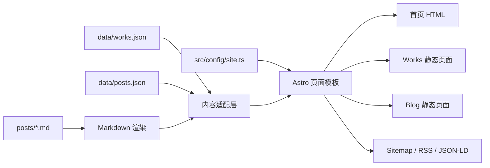

# 个人 AI 品牌网站改版 - 技术设计

> Spec: personal-ai-brand-redesign
> 创建时间: 2026-07-21T17:20:00+08:00
> 状态: 自动模式已批准
> 关联需求: requirements.md

## 架构概述

新站采用 Astro 静态站点生成模式。构建阶段读取现有 `data/works.json`、`data/posts.json` 和 `posts/*.md`，生成首页、Works 列表与详情、Blog 列表与详情、About、RSS、站点地图和 404 页面。核心内容在服务器构建阶段写入 HTML，客户端只保留主题切换、筛选、旧 hash 路由迁移和按需加载评论等增强行为。

改版不会先把全部内容迁入新的 frontmatter 结构，而是通过类型化内容适配层兼容现有数据。这样可以保留 25 个项目和 58 篇文章的单一来源，同时把 UI、URL 和 SEO 一次完成；后续若需要再逐步迁移到 Astro Content Collections。

## 模块设计

### 目录结构

```text
bing-works/
├── astro.config.mjs                 # Astro 静态输出、站点域名、sitemap
├── package.json                     # 开发、构建、校验命令
├── tsconfig.json
├── .env.example                     # SITE_URL 单一域名配置
├── data/                            # 继续作为结构化内容来源
├── posts/                           # 继续作为 Markdown 正文来源
├── public/
│   ├── assets/thumbs/               # Works 缩略图
│   ├── posts/images/                # 文章图片
│   ├── favicon.svg
│   └── robots.txt
├── scripts/
│   └── validate-content.mjs         # slug、文件、链接和数据完整性检查
└── src/
    ├── components/
    │   ├── SiteHeader.astro
    │   ├── SiteFooter.astro
    │   ├── ThemeToggle.astro
    │   ├── WorkList.astro
    │   └── PostList.astro
    ├── config/
    │   └── site.ts                  # 品牌、导航、能力、精选内容、站点 URL
    ├── layouts/
    │   ├── BaseLayout.astro         # head、canonical、OG、主题、旧路由迁移
    │   └── ArticleLayout.astro      # 文章元信息、目录、相关文章、评论
    ├── lib/
    │   ├── content.ts               # Works/Posts 读取、排序、关联与专题映射
    │   ├── markdown.ts              # Markdown 转 HTML、目录与图片路径修正
    │   └── schema.ts                # JSON-LD 生成
    ├── pages/
    │   ├── index.astro
    │   ├── about.astro
    │   ├── 404.astro
    │   ├── works/index.astro
    │   ├── works/[id].astro
    │   ├── blog/index.astro
    │   ├── blog/[slug].astro
    │   └── rss.xml.ts
    └── styles/
        └── global.css               # 文字优先设计系统与响应式样式
```

### 组件职责

| 名称 | 职责 | 关联需求 |
|---|---|---|
| `site.ts` | 集中管理品牌文案、能力支柱、精选项目/文章、导航和域名 | R-001, R-005, R-006 |
| `content.ts` | 将现有 JSON/Markdown 转成类型化项目和文章模型，校验关联 | R-003, R-004, R-006, R-007 |
| `markdown.ts` | 构建阶段生成文章 HTML、标题目录并修正本地图片 URL | R-004, R-007 |
| `BaseLayout` | 统一 head、canonical、OG、结构化数据、主题和无障碍入口 | R-002, R-005 |
| `WorkList` | 文字主导项目列表、分类筛选和必要的缩略图辅助 | R-002, R-003 |
| `PostList` | 编辑式文章列表、专题和日期展示 | R-002, R-004 |
| 动态详情页 | 为全部 Works 和 Blog 内容生成真实静态 URL | R-003, R-004, R-005 |
| `validate-content.mjs` | 在构建前发现重复 slug、缺失文件、坏引用和数量异常 | R-006, R-007 |

## 数据模型

### SiteProfile

| 字段 | 类型 | 说明 |
|---|---|---|
| name | string | 对外显示名 Bing |
| statement | string | 核心主张“从模型能力到生产系统” |
| introduction | string[] | 两行定位说明 |
| capabilities | Capability[] | AI 系统架构、Agent 工程化、技术领导力 |
| principles | string[] | 可验证的工作原则 |
| featuredWorkIds | string[] | 首页精选项目 ID |
| featuredPostSlugs | string[] | 首页精选文章 slug |
| siteUrl | string | 来自 `SITE_URL` 的唯一站点根地址 |

### Work

保留现有字段，并允许增加以下可选字段：

| 字段 | 类型 | 说明 |
|---|---|---|
| year | number | 项目展示年份 |
| focus | string[] | 用于文字列表的技术重点 |
| relatedPosts | string[] | 关联博客 slug |
| caseStudy | object | 背景、职责、约束、决策、实现、交付、复盘 |
| schemaType | string | SoftwareApplication、LearningResource 或 CreativeWork |

### Post

保留现有 `slug/title/date/tags/excerpt/filename/author`，构建时派生：

| 字段 | 类型 | 说明 |
|---|---|---|
| topic | string | AI 原理、Agent 架构、生产工程、技术领导力或其他 |
| updated | string? | 可选真实更新时间 |
| relatedWorks | string[] | 由 Works 反向关联得到 |
| readingMinutes | number | 根据正文长度估算，仅作阅读辅助 |
| html | string | 构建阶段 Markdown 输出 |
| headings | Heading[] | H2/H3 目录 |

## 数据流



## 页面与 URL 设计

| 页面 | URL | 核心内容 | 结构化数据 |
|---|---|---|---|
| 首页 | `/` | 品牌主张、三项能力、精选项目、精选文章、原则 | Person, WebSite |
| Works | `/works/` | 全部项目、分类筛选 | CollectionPage, ItemList |
| 项目详情 | `/works/{id}/` | 项目定位、案例内容、演示/源码、相关文章 | SoftwareApplication / LearningResource / CreativeWork |
| Blog | `/blog/` | 专题入口、文章列表 | Blog, CollectionPage |
| 文章详情 | `/blog/{slug}/` | 元信息、正文、目录、关联内容、评论 | BlogPosting, BreadcrumbList |
| About | `/about/` | 专业方向、工作方式、联系入口 | ProfilePage, Person |

## 视觉与交互设计

- 页面最大宽度 `960px`，文章正文约 `720px`，使用 4/8px 间距体系。
- 首页不展示大幅项目图；以 48px 桌面标题、36px 移动标题、16px 正文建立层级，不使用随视口连续缩放字号。
- 浅色使用冷白背景和近黑正文，深色使用中性墨黑；品牌色为克制蓝绿色，状态可少量使用琥珀色。
- 不使用渐变、玻璃拟态、装饰光球、嵌套卡片和大圆角。边框和分隔线承担内容分组。
- Works 缩略图只在完整档案中作为辅助，固定宽高比避免布局移动。
- 所有链接和按钮具备键盘焦点；主题按钮交互区域至少 44px；尊重 `prefers-reduced-motion`。

## SEO 设计

- `SITE_URL` 是 canonical、Open Graph、RSS、sitemap 的唯一根地址；默认值集中在配置中并允许环境变量覆盖。
- `BaseLayout` 接收页面级 title、description、image、type 和 JSON-LD，不在子页面重复拼接 head。
- 首页生成 Person/WebSite；文章生成 BlogPosting/BreadcrumbList；项目按 `schemaType` 生成对应 JSON-LD。
- `@astrojs/sitemap` 收集静态路由，RSS endpoint 从文章模型生成。
- `robots.txt` 使用绝对 sitemap URL；若构建域名覆盖，构建脚本同步生成正确内容。
- 旧 hash 路由只保留一段内联迁移脚本，新生成链接全部为真实 URL。

## 技术决策

| 决策点 | 选择 | 理由 |
|---|---|---|
| 站点框架 | Astro 静态输出 | 直接输出完整 HTML，适合内容站，客户端 JS 可控 |
| 内容迁移 | 适配现有 JSON + Markdown | 保持单一来源，避免一次性重写 58 篇文章 frontmatter |
| Markdown | 构建阶段使用成熟解析库 | 支持现有代码块、表格和引用，避免继续维护脆弱正则解析器 |
| 搜索 | 第一版使用浏览器端轻量过滤 | 58 篇规模无需引入服务端搜索；核心内容不依赖搜索脚本 |
| 样式 | 单一全局设计系统 | 页面少、风格统一，避免组件级样式碎片化 |
| 项目案例 | Works JSON 可选 caseStudy 字段 | 基础页覆盖全部项目，重点项目逐步增强且不复制数据 |
| 域名 | `SITE_URL` 单一配置 | 正式域名未确认时避免模板散落错误 canonical |

## 兼容与迁移

- 根目录现有 `index.html`、`js/` 和 `css/` 在 Astro 构建确认前保留，最终清理任务再移除，便于对照和回退。
- 缩略图与文章图片复制到 `public/`，源文件在验证前保留；构建输出只使用 `public/` 版本。
- 旧 `#/blog/{slug}` 在新首页加载时转换到 `/blog/{slug}/`；`#/blog` 转到 `/blog/`。
- Giscus 仅在文章页加载并使用现有 `wanxb/bing-works` 仓库配置。

## 影响分析

### 新增与修改

| 模块 | 变更类型 | 说明 |
|---|---|---|
| 构建配置 | 新增 | Astro、TypeScript、依赖与命令 |
| `src/` | 新增 | 页面、布局、组件、内容适配和样式 |
| `public/` | 新增 | 静态资源、favicon、robots |
| `data/works.json` | 修改 | 重点项目案例、年份、技术重点与相关文章 |
| `README.md` | 修改 | 新开发、构建、内容维护和域名配置方式 |
| 旧 SPA 文件 | 最终清理 | 构建验收后移除不再使用的入口和脚本 |

### 依赖与配置

- 新增 Node.js 依赖：Astro、sitemap、RSS、Markdown 解析器。
- 新增环境变量：`SITE_URL`，默认暂定 `https://bbing.xyz`，部署时可覆盖。
- 无数据库、API 或服务端运行时变更。
